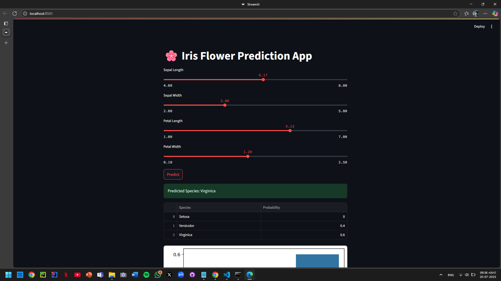
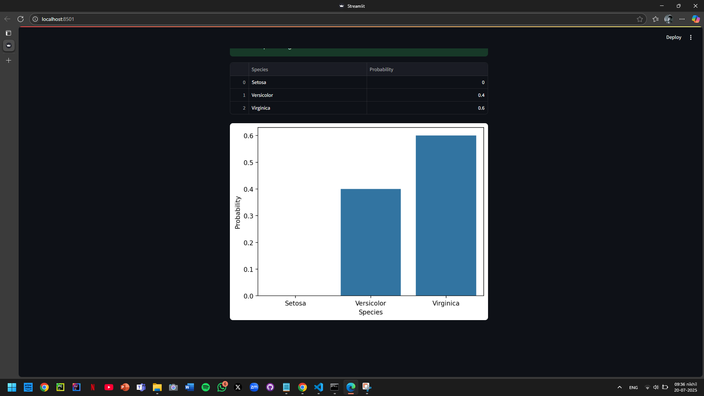

# 🌸 Iris Flower Prediction Web App

This project is a **Streamlit web application** that predicts the species of an Iris flower based on user input features such as:

* Sepal Length
* Sepal Width
* Petal Length
* Petal Width

The application uses a **Random Forest Classifier** trained on the famous **Iris dataset**.

---

## 🚀 Features

* Interactive sliders to input flower measurements
* Instant prediction of flower species
* Display of prediction probabilities
* Visualization of probabilities using a bar chart
* Clean and interactive web interface

---

## 🛠️ Technologies Used

* **Python**
* **Scikit-learn** for model training
* **Streamlit** for creating the web app
* **Matplotlib** & **Seaborn** for visualizations
* **Pandas** and **NumPy** for data handling

---

## 📦 Setup Instructions

### 1. Clone or Download the Project

```bash
git clone <repository_link>
```

### 2. Create a Virtual Environment

```bash
python -m venv env
```

### 3. Activate the Virtual Environment

* On Windows:

```bash
env\Scripts\activate
```

* On macOS/Linux:

```bash
source env/bin/activate
```

### 4. Install Required Libraries

```bash
pip install -r requirements.txt
```

### 5. Train the Model (Optional)

If `model.pkl` is not available, run:

```bash
python train_model.py
```

### 6. Run the Streamlit Application

```bash
streamlit run app.py
```

Visit **[http://localhost:8501](http://localhost:8501)** to use the web app.

---

## 📁 Project Structure

| File               | Purpose                               |
| ------------------ | ------------------------------------- |
| `train_model.py`   | Script to train and save the ML model |
| `model.pkl`        | The trained Random Forest model       |
| `app.py`           | Streamlit app for prediction          |
| `requirements.txt` | List of dependencies                  |
| `README.md`        | Project documentation                 |

---

## 📸 Example Screenshots

<h3>🌟 Input Interface</h3>


<h3>📊 Probability Visualization</h3>


---

## ✅ Future Enhancements

* Deploy the app on cloud platforms like Streamlit Cloud or Heroku
* Add feature importance visualization
* Extend the app to handle other datasets

---

## 🙌 Acknowledgements

* [Streamlit Official Documentation](https://docs.streamlit.io/)
* [Machine Learning Mastery Guide on Streamlit Deployment](https://machinelearningmastery.com/how-to-quickly-deploy-machine-learning-models-streamlit/)
